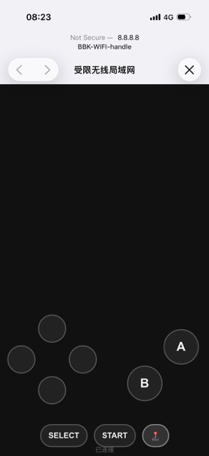
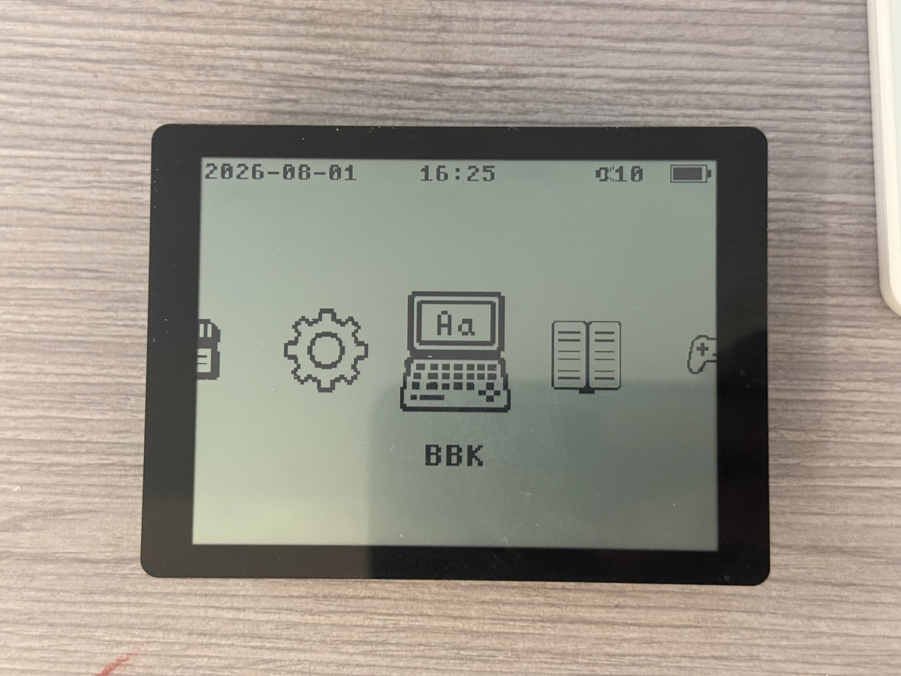
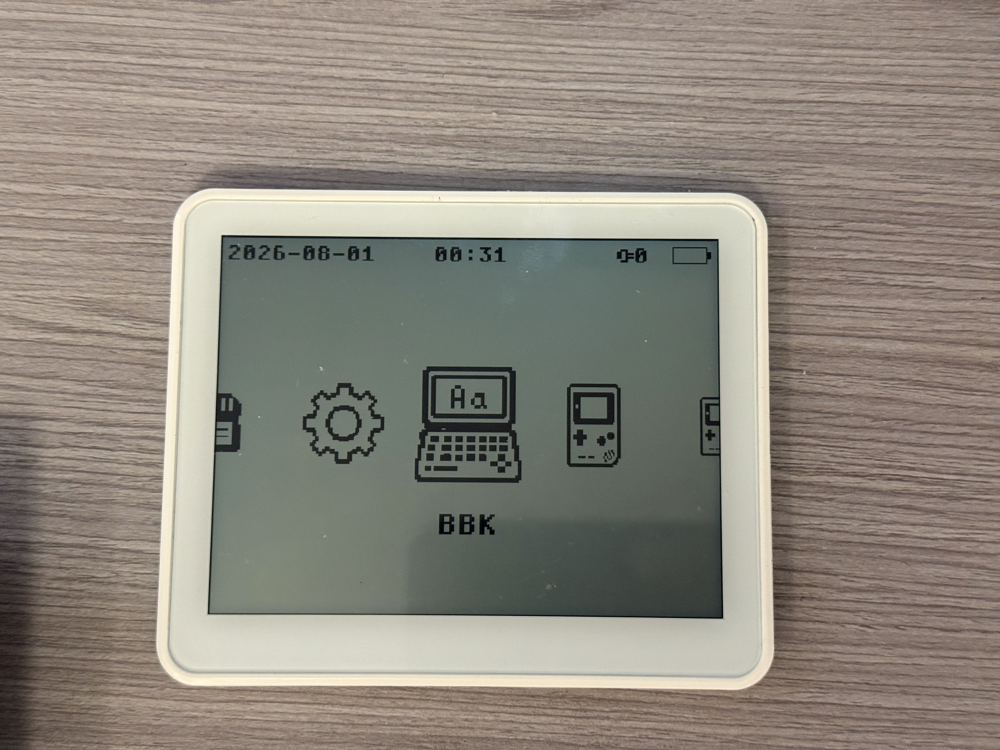
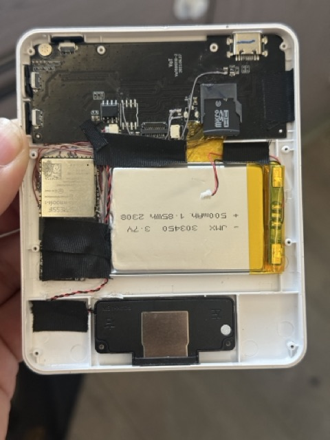
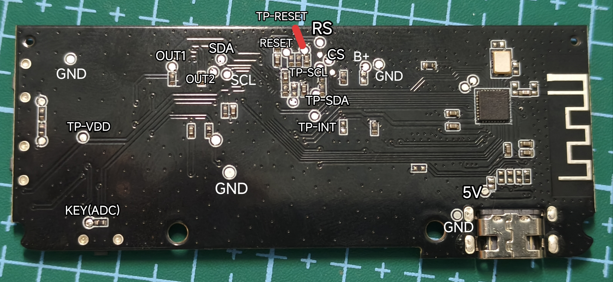

# ESP32-S3-RLCD-BBK

**复古电子词典 / 游戏机固件** — ESP32-S3 + ST7305 反射式 1bit LCD(400x300),
内置步步高电子词典(BBK 4980 系列)模拟器、GB / GBC / NES / Arduboy 四个游戏引擎、
电子书阅读器、蓝牙手柄与 WiFi 网页手柄。

> **在线刷机**:https://bbk.linit.cn/flash/ (浏览器 WebSerial 直刷 16MB 固件,需 Chrome/Edge)

---

## 功能

**模拟器**
- **BBK 电子词典**(gam4980 / libretro 核心 + s6502):词典/游戏,全屏 EPX 抗锯齿,进度存档到 SD
- **GB / GBC**(gnuboy 移植):4 级灰度 1bit 渲染,电池存档
- **NES**(nofrendo):256x224 灰度帧,全屏/点对点
- **Arduboy**(simavr ATmega32u4)

**应用**
- 电子书阅读器:txt/GBK/UTF-8,书签/进度,4 方向旋转,夜间模式
- 壁纸屏保:星空动画 + 游戏壁纸(待机时运行真实游戏)
- 番茄钟、MP3 播放、天气时钟、系统信息
- 隐藏设置(见上文):音频方案(解码/方波PWM/禁用)、禁用触摸

**交互**
- 主菜单 cover-flow 跟手拖动;游戏/书籍列表整列拖动
- 蓝牙 HID 手柄 10 键映射;WiFi 网页手柄(AP "BBK-WIFI-handle", 8.8.8.8 弹窗)

---

## 操作说明

### 物理按键

| 按键 | 短按 | 长按 |
|---|---|---|
| **KEY** (GPIO18) | 确认 | 多功能键(收藏等) |
| **BOOT** (GPIO0) | 右 | 返回 (BACK) |
| **PWR** (GPIO1) | 锁屏 | 0.5s=返回菜单提示,松手回主菜单; **2s=关机** |

### 触摸手势

| 手势 | 效果 |
|---|---|
| **点击** | 确认(点哪进哪) |
| **左右滑** | 主菜单切换图标 / 游戏内左右 |
| **上下滑** | 列表选择移动 |
| **状态栏长按 3s** | 返回主菜单(任何界面) |
| **底部中间上滑** | 返回(再滑一次=确认退出) |
| **长按 ≥0.8s**(不移动) | 收藏 / 取消收藏 |

### 各功能操作

- **BBK 词典**:分栏(左=设置/收藏/文件夹,右=游戏列表),点击启动;游戏内触摸=按键(点=确认,滑=方向);退出=BOOT 长按或 PWR 0.5s
- **电子书**:书库选书;阅读时点上半=上一页、下半=下一页、中间=设置菜单;书设置含旋转(上下左右)、夜间模式、字号、边距
- **蓝牙手柄**:手柄 → 添加设备(蓝牙扫描)/ 按键映射(10 键)/ 连接记录。
  **注意:ESP32-S3 仅支持 BLE(BT 4.0+),不支持传统蓝牙(BT Classic),
  Xbox 等传统蓝牙手柄不兼容**;目前实测 **ShanWan(闪玩)Q36** 连接正常。
- **WiFi 网页手柄**:手柄 → WiFi 手柄 → 开启热点(AP: **BBK-WIFI-handle**)。
  手机连接该热点,浏览器打开 **http://8.8.8.8**(自动弹出),即出虚拟手柄界面,
  支持方向键 + A/B/Start/Select。按键映射见下图:

  
- **壁纸**:内置星空 / 游戏壁纸(待机跑游戏)/ 休眠时间 / 测试壁纸
- **番茄钟**:弹窗设置工作/休息分钟,开始后全屏倒计时,任意键返回
- **MP3**:播放列表,左右键调音量(0-10 档)

### 状态栏

左侧日期,中间时间,右侧:**电池 → 蓝牙图标 → 喇叭+音量 → WiFi**(连接时显示)

---

## 如何开启隐藏游戏与隐藏设置

> **隐藏游戏**(GB / GBC / NES / Arduboy 引擎,解锁后出现在主菜单):

1. 主菜单 → **设置** → 弹窗中选择 **「请作者喝杯水」**(进入全屏赞助图)
2. 在赞助图上**连续按确认键 5 次**
3. 提示解锁后返回主菜单,即可看到 **GB / GBC / NES / arduboy** 图标

> **隐藏设置**(音频方案 / 禁用触摸屏):

1. 主菜单 → **设置** → **系统信息**
2. 在 **「BY: LinIT」** 一行上**连点 5 次**
3. 弹出隐藏设置:音频方案(解码输出 / 方波直驱 / 禁用音频)、禁用触摸屏

---

## 硬件说明

MCU: **ESP32-S3**(240MHz, 8MB PSRAM, 16MB Flash)。支持以下两种硬件:

### 路线一:微雪(Waveshare)ESP32-S3-RLCD-4.2 开发板

可直接烧录本固件使用,自带屏幕。**注意:该开发板无触摸屏**,需用按键操作
(部分功能以触摸为主,建议配合蓝牙手柄)。原理图/接线图:
`docs/ESP32-S3-RLCD-4.2-schematic.pdf`。



### 路线二:拼多多「拼音学练机」改造(本项目实际硬件)

拆机换 ESP32-S3,接线如下:





| 外设 | 引脚 | 说明 |
|---|---|---|
| 屏幕 ST7305 | DC=5, CS=40, SCK=11, MOSI=12, RST=41 | SPI2, 400x300 1bit 反射式(**TE 引脚不接**) |
| 触摸 CST816 | SDA=15, SCL=7, INT=17, RST=2 | I2C_NUM_1 |
| TF 卡 | CMD=21, CLK=38, D0=39 | SDMMC 1bit |
| 按键 ×3 | BOOT=GPIO0, KEY=GPIO18, PWR=GPIO1 | 右/返回, 确认/多功能, 锁屏/返回菜单/关机 |
| 方波声音(PWM) | GPIO48 → AXS2005B 功放 → 喇叭 | 隐藏设置音频方案选「方波直驱」 |
| 解码声音(可选) | ES8311: I2C SDA=13 SCL=14; I2S MCLK=16 BCLK=9 WS=45 DOUT=8; PA=46 | 不接则建议音频方案关声音或选 PWM |
| USB 电源 | AMS1117(5V→3.3V) + 充放电模块 | 供电 / 电池充电 |

> **接线补遗**:触摸 INT/RST 必须接(否则触摸失效);功放使能 PA=46;
> 喇叭接功放输出;充放电模块电池端接锂电池,输出 5V 进 AMS1117。
> 蓝牙 / WiFi 天线为 ESP32-S3 模组内置,无需外接。

> **本路线必读**:屏幕 TE 引脚不接;若未接 ES8311 解码器,
> 需在「隐藏设置」(系统信息 → BY: LinIT 连点 5 次)把音频方案设为
> **「方波直驱(PWM)」** 或 **「禁用音频」** 才能正常发声/无声。
> 微雪开发板原理图与接线图见 `docs/ESP32-S3-RLCD-4.2-schematic.pdf`。

**主板测试点定义**(改造焊接参考):



---

## 目录结构

```
├── main/                # 主循环: 渲染调度 / 输入分发 / 屏保 / 软关机
├── components/
│   ├── gam4980/         # BBK 电子词典 (libretro 核心 + s6502 + EPX 渲染)
│   ├── gbc_emu/ gb_emu/ # GB/GBC (gnuboy)
│   ├── nes_emu/         # NES (nofrendo)
│   ├── arduboy_avr/     # Arduboy (simavr)
│   ├── book_reader/     # 电子书 (排版/分页/书签/旋转/夜间)
│   ├── menu/            # 菜单系统/游戏列表/设置/壁纸/番茄钟/配置持久化
│   ├── board_shim/      # 引擎帧 → ST7305 1bit 缩放/灰度转换 (core0 视频任务)
│   ├── st7305/          # LCD 驱动 (fb 布局: 2列x4行/字节)
│   ├── input/           # 触摸手势 (点击/滑动/长按/旋转坐标)
│   ├── audio_player/    # ES8311 + PCM/MP3 环形缓冲
│   ├── tone_player/     # GPIO48 方波 PWM 音效
│   ├── touch_panel/     # CST816 驱动
│   ├── bt_manager/ web_gamepad/ virtual_keys/  # 蓝牙/网页/屏幕虚拟手柄
│   └── ...              # 其余支撑组件
├── tools/               # 图标/字库生成脚本, 串口日志捕获
├── system_image/        # BBK 词典系统 ROM (8.BIN + E.BIN)
├── docs/HANDOVER.md     # 完整交接文档 (AI 接手必读: 机制/坑/历史修复)
├── sdkconfig.defaults   # 构建配置 (含 mbedtls 证书包等)
└── partitions.csv       # 分区表 (app 8.94MB @0x10000, system 4MB @0x900000)
```

---

## 构建

要求 ESP-IDF **v5.5.x**(本项目基于 v5.5.5 开发,工具链 xtensa-esp-elf 14.2.0)。

```bash
idf.py reconfigure   # 首次: 拉取依赖组件
idf.py build         # 构建
./build.sh           # 或一键构建 (fullclean + 合并 16MB 镜像)
```

## 烧录

**方式一: 应用更新(分区不变)**
```bash
python -m esptool --chip esp32s3 -b 460800 write_flash \
  --flash_mode dio --flash_size 16MB --flash_freq 80m \
  0x10000 build/esp32-bbk-emu.bin
```

**方式二: 完整 16MB 镜像(新设备/含系统 ROM)** — 先 `./merge_flash.sh` 生成
`dist/merged_16mb.bin`,再烧 0x0。

## 系统 ROM

BBK 词典需要系统 ROM `8.BIN` + `E.BIN`(各 2MB),已随仓库提供在
`system_image/`。组装 4MB `system.bin` 后烧到 **0x900000**:

```bash
cat system_image/8.BIN system_image/E.BIN > system_image/system.bin
./merge_flash.sh    # 生成完整 16MB 镜像 dist/merged_16mb.bin
```

---

## 版权说明与参考链接

**非常感谢以下开源项目！感谢现在发达的 AI！以及感谢梁文峰带来的 DeepSeek！！！！！**

- **BBK 4988 内核**: gam4980(libretro 核心) — [github.com/ThisBoringWorld/gam4980](https://github.com/ThisBoringWorld/gam4980)
- **GB/GBC、NES**: esp-box-emu(gnuboy、noFrendo) — [github.com/espressif/esp-box-emu](https://github.com/espressif/esp-box-emu)
- **AB 模拟器适配层**: 精简自 UVE5 对讲机项目的 arduboy_avr.cpp — [github.com/losehu/UVE5](https://github.com/losehu/UVE5)
- 本项目部分界面与模拟器思路参考了 **esp32-s3-rlcd-gb-emulator**
- 详细开发交接文档见 `docs/HANDOVER.md`
